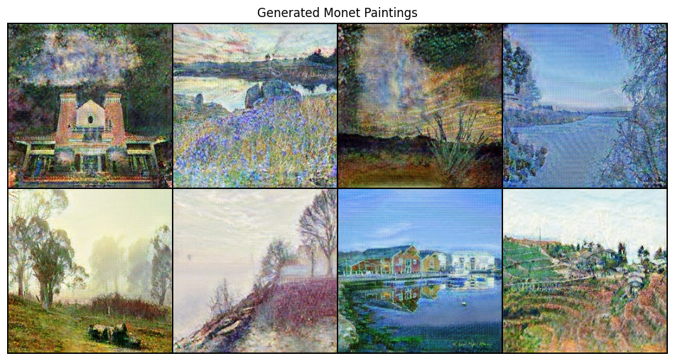
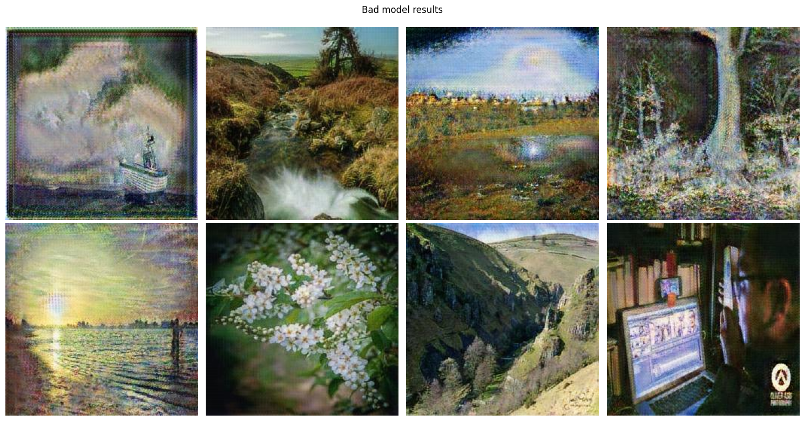

# I’m Something of a Painter Myself

This is my solution for the [Kaggle competition](https://www.kaggle.com/competitions/gan-getting-started), where the goal is to generate images in the style of a famous painter – Claude Monet. For this task, I used a Generative Adversarial Network (GAN) with a CycleGAN architecture. The architecture is presented in the [paper](https://arxiv.org/pdf/1703.10593) by Jun-Yan Zhu et al.

[Link on my kaggle notebook](https://www.kaggle.com/code/pavelkopka/i-m-something-of-a-painter-myself)


# Setup

1. Clone the repository
```bash
git clone <repository-url>
cd <repository-name>
```

2. Create a virtual environment and activate it:
```sh
python -m venv venv
source venv/bin/activate
```

3. Install the required packages:
```sh
pip install -r requirements.txt
```

4. Download the datasets:
```sh
./download_monet_dataset.sh
```


# Training
```sh
python train.py
```

For configuration look in the `model/config.py` file.

By default model is trained for 200 epochs with decreasing learning rate and `lambda_cycle`. Checkpoints are saved in the `./checkpoints` directory and model automatically restores latest checkpoint if it exists.

# Examples of generated images
Here are some examples of generated images:


Not all generated images are perfect. Here are some examples of bad images:

